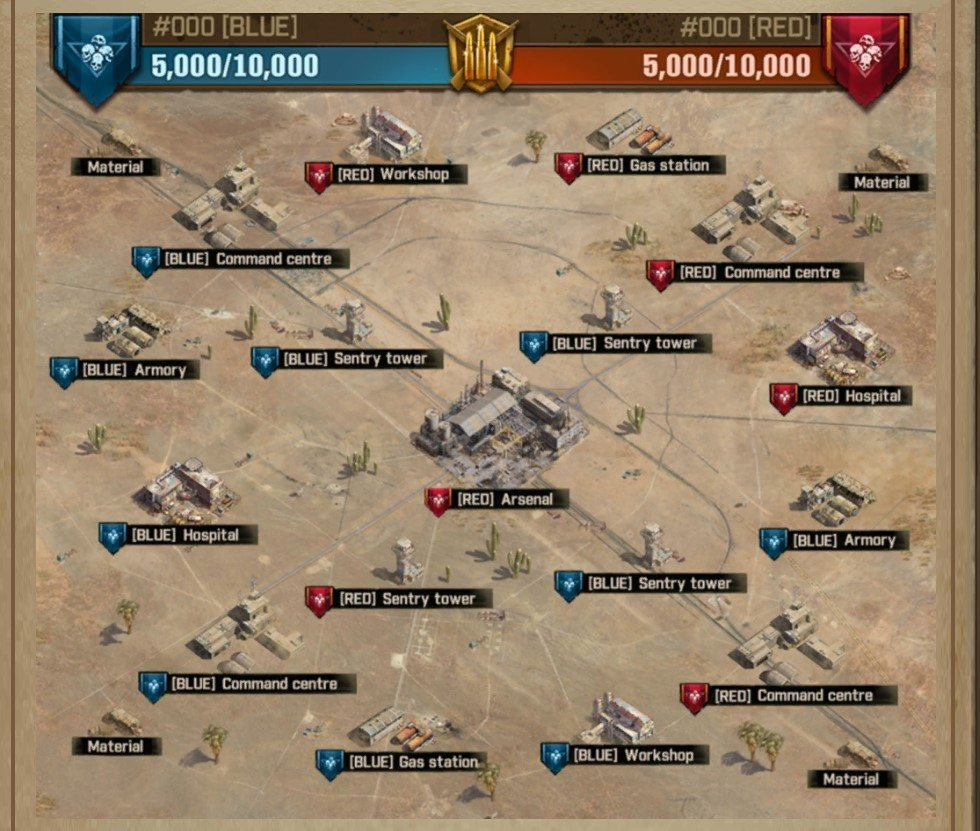

## Rules for event on 07-08-2021 (7th August 2021)
- We have a deal with the enemy clan, they will let us win. But there are some conditions.
- Players from both the clans will not attack each other's town or buildings. They will not attack our building and we will not attack their building. The same goes for the town.
- We have a deal so that they will lose with close margin, making this happen needs something which we need to take care of.
- We will not gather at gathering sites, we will not attack zombies on the battlefield (building zombies are an exception, we need to occupy buildings right?)
- They will gather and kill zombies on our side too, so please let them.
- We will attack the arsenal and garrison it with our F1, we will also have all of our side's buildings.
- If they are getting more points than us at any point we will just start to gather on our side and if no site is empty we will attack and get some gathering sites (all of you need to wait for leaders command for gathering, Leaders will be templer, tashmae, rjsatyadev)
- If I find anyone breaking the rules, I will remove you from the clan for 1 day and you will not get entry to restricted zone next time. this applies to leaders also. 

## Team Responsibility
- Team 1 will occupy Arsenal
- Team 2 will occupy the Command centre at the top
- Team 3 will occupy the Command centre at the bottom
- All send F2 to get Workshop
- All send F3 to get hospital
- After occupying the workshop everyone need to relocate and garrison building (Team 1 to the arsenal, Team 2 Command centre top, Team 3 Command centre bottom)
- All send F4 to get Gas Station
- Team 1 send F3 to armoury
- Team 2 send F3 to occupy the guard tower at the top
- Team 3 send F3 to occupy the guard tower at the bottom
- Everyone needs to garrison with F1 F2
- ignore any other rules at the bottom.

## **Teams and Groups BBQ**
| Team 1 | Team 2 | Team 3 | Team 4 | Reserved |
| ------------ | ------------ | ------------ | ------------ | ------------ |
| RJSATYADEV (LEADER) | Templer88 (LEADER) | TASHMAE (Leader) | - | - |
| EYVALLAH | Watts | Maz1177 | - | - |
| Never Enough | pilon | Xibitz | - | - |
| Pr0digy | Usmish | Lagertha | - | - |
| Don Makaron | xFuriosax | ozmoooo | - | - |
| TAR88 | amican | Xtrmo | - | - |
| WiNtEr | True1 | Leticia | - | - |
| pika pikaaaa | fernandita | - | - | - |
| - | - | - | - | - |
| - | - | - | - | - |

## Poll Details
1. Username:
2. Should we assign a tides partner to you? (Yes or No)
3. Base Power of Town
4. F1 Power
5. F2 Power
6. F3 Power
7. Highest Level of walkers defeated? (16 to 25)
8. Location X
9. Location Y
10. Technology percentage of F1
11. Technology percentage of F2
12. Technology percentage of F3
14. Preferred timing for Events such as Tides, Survivor Camp, Community.

## **Buildings and Buffs**

1.  ### **Command Center (Corner big building):**

    1.  An occupied Command Center provides Victory Points (Solo and Clan) for the occupying Clan. It also allows members of the occupying Clan to relocate near the Command Center. If the Command Center is taken, you will automatically relocate to your Clan’s Safe Zone.

2.  ### **Arsenal (Center Building) :**

    1.  An occupied Arsenal provides Victory Points (Solo and Clan), plus a bonus amount of Victory Points every 10 minutes (Clan).

3.  ### **Supply point (Material in Map):**

    1.  Members of your Clan can send Formations to Supply Points to gather Victory Points (solo and for our Clan).

4.  ### **Guard Tower (Sentry Tower in Map):**

    1.  An occupied Guard Tower provides Victory Points (Solo and Clan) for the occupying Clan. It also increases damage dealt to the enemy in the Arsenal. This damage buff stacks.

5.  ### **Workshop :**

    1.  An occupied Workshop provides Battlefield Relocation items for members of the occupying Clan (only for use on the battlefield).

6.  ### **Ammo depot (Armory in Map) :**

    1.  An occupied Ammo Depot greatly increases the attack and defence of the members of the occupying Clan.

7.  ### **Gas station :**

    1.  An occupied Gas Station provides Adrenaline to members of the occupying Clan, needed to allow Formations to march over the battlefield.

8.  ### **Hospital :**

    1.  An occupied Hospital greatly increases the healing speed for members of the occupying Clan.

##  **Starting Rules:**

1.  Heal all your troops before joining the battle. Hospitals will have +500% capacity as I have seen. It means if your hospital can have 10,000 troops in main game, there will be space for 50,000 troops in restricted zone. 

2.  Constantly heal your troops after starting the battle, if your hospitals are full they are going to die in the main game too

3.  We need either 50 million (50,000,000) points or more points than other clan at the time end for winning the game

## **Building Occupying order:**

1.  Command Center to start getting points

2.  I need all members F4 and F3 in Supply (Material in the map) points for gathering victory points at the start of the game, switch or cycle survivors after F1 F2 adrenaline is over (Stamina) and send F1 F2 to gather. If putting 2 formations is not allowed send F4 to the supply point

3.  Ammo Depot (Armory) for attack defence buff

4.  Gas Station for adrenaline (Stamina in the main game)

5.  Workshop for relocating anywhere in-game

6.  Guard Towers for attack buff

7.  Hospitals for increased healing speed

8.  Arsenal (Last and the most important building to occupy)

## **Getting the victory points:**

There are 4 different ways we can get victory points

1.  Occupy Command centre (first thing to do)

2.  Gather into supply zone (Material in the map)

3.  Kill Walkers around the map

4.  Occupy arsenal

· **Note**: Once we occupy the Command centre everyone needs to make sure the enemy cannot occupy it. This building will be the sole reason we can win this event

## Other things to note:
- every building will have some time before it can be occupied, just like communities (around 2-3 minutes) make sure we garrison the building after attacking.
- heal all your troops before entering the battle, hospitals must be empty.
- after occupying buildings, if you have extra adrenaline, use it to defeat walkers. switch out survivors from F1 to F2 and F1 to F3 so you can defeat the highest level. The more walkers you defeat the more victory points we get. 
- send your F3 and F4 to gather in the supply zone after killing walkers with it. save 20-30 percent adrenaline if there is an emergency.
- save your relocation cards you can only get more once you occupy the workshop.
- always click the help button, heal troops in 10 minutes batches. for example, putting 30 T7 troops for healing takes 10 minutes. I am suggesting this because we have players who can click the help button so those 10 minutes will be instantly finished.
- if you don't have any RSS, get some from inventory. we need at least something for healing the troops and you are not getting any RSS on the battlefield.

## Warnings:
- Talk only about important things in the main chat. No Hi hello or jokes, if you chat without any kind of importance and other members cannot read important messages because of you, you will be kicked from the whole event.
- Don't leave the event and get into the main game. if you do that you can not join the event again, substitute players will take your place.
- all substitutes will be placed according to the absence of selected players in their respective teams.
